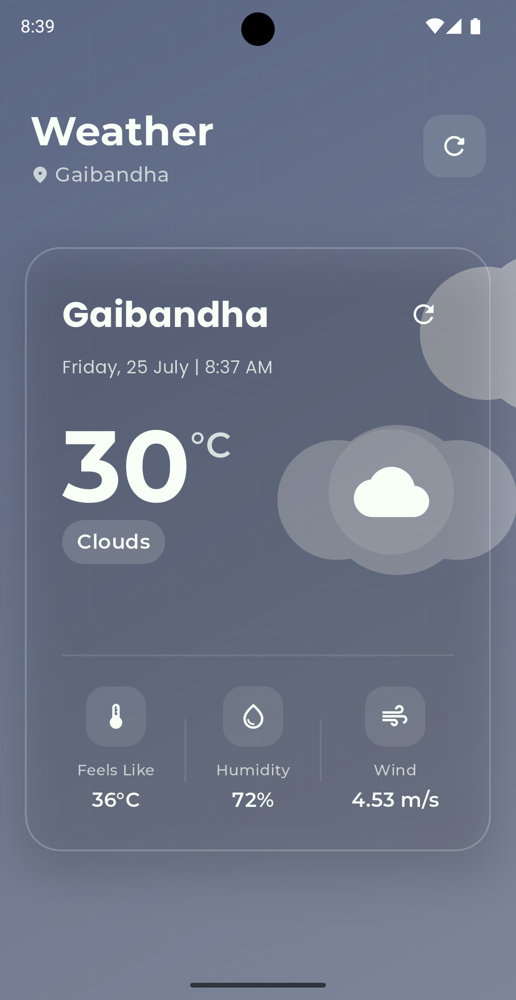

# 🌦️ Weather App - 100 Days of Flutter Challenge

[](https://flutter.dev/)
[](https://dart.dev/)
[](https://openweathermap.org/api)
[](https://github.com/yourusername/day_06_weather_app)

## 📱 Overview
A beautiful, animated weather application built as part of the 100 Days of Flutter Challenge. This app fetches real-time weather data from the OpenWeatherMap API and displays it with elegant animations and UI effects. The app features a modern glassmorphic design with dynamic backgrounds that change based on current weather conditions.

## ✨ Features
- 📍 **Current Location Detection** - Automatically fetches weather for your current location
- 🎨 **Dynamic Themes** - UI colors and backgrounds adapt to current weather conditions
- 🔄 **Real-time Updates** - Pull-to-refresh functionality for latest weather data
- 🌈 **Glassmorphic UI** - Modern, translucent card design with blur effects
- ⚡ **Smooth Animations** - Beautiful transitions and weather animations
- 📱 **Responsive Design** - Adapts perfectly to all screen sizes
- 🌡️ **Detailed Weather Info** - Temperature, humidity, wind speed, and more

## 🎬 Weather Animations
The app features beautiful Lottie animations that change based on current weather conditions:

- ☀️ **Sunny** → Vibrant Yellow/Orange gradient with animated sun rays
- 🌧️ **Rainy** → Soothing Dark Blue background with realistic animated raindrops
- ☁️ **Cloudy** → Soft Gray-Blue tones with gently moving cloud formations
- 🌩️ **Thunderstorm** → Dramatic Dark Purple background with lightning flash effects
- ❄️ **Snow** → Serene Light Blue background with falling snowflakes animation

## 📂 Project Structure
The app follows a clean, modular architecture for better maintainability and scalability:

```
lib/
 ┣ models/
 ┃ ┗ weather_model.dart         // Data models for weather information
 ┣ services/
 ┃ ┗ weather_service.dart       // API integration with OpenWeatherMap
 ┣ providers/
 ┃ ┗ weather_provider.dart      // State management using Provider
 ┣ screens/
 ┃ ┗ home_screen.dart           // Main UI with weather display
 ┣ widgets/
 ┃ ┣ weather_card.dart          // Glassmorphic card for weather info
 ┃ ┗ animated_background.dart   // Dynamic weather animations
 ┣ utils/
 ┃ ┣ theme_colors.dart          // Weather-based color schemes
 ┃ ┗ api_key.dart               // API key configuration
 ┗ main.dart                    // App entry point
```

### Assets
```
assets/
 ┣ animations/                  // Lottie animation files
 ┃ ┣ sunny.json
 ┃ ┣ rainy.json
 ┃ ┣ cloudy.json
 ┃ ┣ thunderstorm.json
 ┃ ┗ snow.json
 ┗ images/                      // App images and screenshots
   ┗ weather_screen.png
```

## 🚀 Setup Instructions

### Prerequisites
- Flutter SDK (3.19.0 or later)
- Dart SDK (3.3.0 or later)
- Android Studio / VS Code with Flutter extensions
- An OpenWeatherMap API key

### Installation Steps
1. **Clone the repository**
   ```bash
   git clone https://github.com/yourusername/day_06_weather_app.git
   cd day_06_weather_app
   ```

2. **Get your API key**
   - Create a free account at [OpenWeatherMap](https://openweathermap.org/api)
   - Generate an API key from your account dashboard

3. **Configure the API key**
   - Create a file at `lib/utils/api_key.dart` with the following content:
     ```dart
     const String apiKey = 'YOUR_API_KEY_HERE';
     ```

4. **Install dependencies**
   ```bash
   flutter pub get
   ```

5. **Run the app**
   ```bash
   flutter run
   ```

### Troubleshooting
- If you encounter location permission issues, ensure your emulator/device has location services enabled
- For API-related errors, verify your API key is correctly configured
- If animations don't load, check that Lottie files are correctly placed in the assets folder

## 📦 Dependencies

| Package | Version | Purpose |
|---------|---------|----------|
| [http](https://pub.dev/packages/http) | ^1.1.0 | API requests to OpenWeatherMap |
| [geolocator](https://pub.dev/packages/geolocator) | ^10.0.0 | Device location detection |
| [provider](https://pub.dev/packages/provider) | ^6.0.5 | State management |
| [lottie](https://pub.dev/packages/lottie) | ^2.6.0 | Weather animations |
| [flutter_spinkit](https://pub.dev/packages/flutter_spinkit) | ^5.2.0 | Loading indicators |
| [google_fonts](https://pub.dev/packages/google_fonts) | ^5.1.0 | Custom typography |
| [intl](https://pub.dev/packages/intl) | ^0.18.1 | Date/time formatting |

## 📸 Screenshots

<p align="center">
  
</p>

## 🔑 Key Learning Points
- Implementing dynamic UI based on weather conditions
- Working with RESTful APIs and handling responses
- Managing application state with Provider
- Creating custom animations for enhanced user experience
- Implementing location services in Flutter
- Building responsive and beautiful UI with glassmorphism design
- Error handling and loading states

## 🚀 Future Improvements
- Add support for multiple locations
- Implement weather forecasts for upcoming days
- Add settings for temperature units (Celsius/Fahrenheit)
- Implement dark/light mode toggle
- Add weather notifications
- Optimize performance for older devices

## 👥 How to Contribute
1. Fork the repository
2. Create your feature branch (`git checkout -b feature/amazing-feature`)
3. Commit your changes (`git commit -m 'Add some amazing feature'`)
4. Push to the branch (`git push origin feature/amazing-feature`)
5. Open a Pull Request

## 📄 License

```
MIT License

Copyright (c) 2023 Your Name

Permission is hereby granted, free of charge, to any person obtaining a copy
of this software and associated documentation files (the "Software"), to deal
in the Software without restriction, including without limitation the rights
to use, copy, modify, merge, publish, distribute, sublicense, and/or sell
copies of the Software, and to permit persons to whom the Software is
furnished to do so, subject to the following conditions:

The above copyright notice and this permission notice shall be included in all
copies or substantial portions of the Software.

THE SOFTWARE IS PROVIDED "AS IS", WITHOUT WARRANTY OF ANY KIND, EXPRESS OR
IMPLIED, INCLUDING BUT NOT LIMITED TO THE WARRANTIES OF MERCHANTABILITY,
FITNESS FOR A PARTICULAR PURPOSE AND NONINFRINGEMENT. IN NO EVENT SHALL THE
AUTHORS OR COPYRIGHT HOLDERS BE LIABLE FOR ANY CLAIM, DAMAGES OR OTHER
LIABILITY, WHETHER IN AN ACTION OF CONTRACT, TORT OR OTHERWISE, ARISING FROM,
OUT OF OR IN CONNECTION WITH THE SOFTWARE OR THE USE OR OTHER DEALINGS IN THE
SOFTWARE.
```

This project is licensed under the MIT License as shown above.

## 🙏 Credits
Created as part of the 100 Days of Flutter Challenge.

---

<p align="center">Made with ❤️ using Flutter</p>
